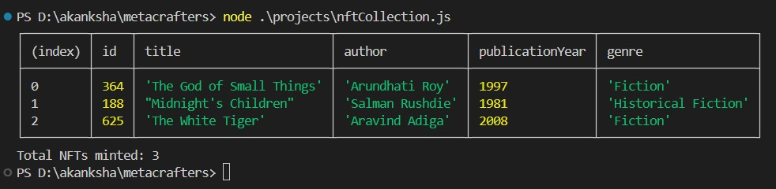

# JavaScript_Module1

# NFT Collection in JavaScript

In this repository, the code written in JS is for storing and printing NFTs (Non-Fungible Tokens) for a user. The code demonstrates how to create, manage, and display an NFT collection using JavaScript. Below is a step-by-step explanation of the code.

## Steps to Create and Manage NFTs

### 1. Create a Variable to Hold Your NFTs
creating an empty array to store our NFTs.
```javascript
let nfts = [];
```

### 2. Create a Set to Store Used IDs
A Set to keep track of the IDs that have already been used to ensure each NFT has a unique ID.
```javascript
let usedIds = new Set();
```

### 3. Create a Function to Generate a Unique Random ID
This function generates a random ID between 1 and 1000 and checks if it has already been used. If it has, it generates a new one until it finds a unique ID.
```javascript
function generateRandomId() {
    let id;
    do {
        id = Math.floor(Math.random() * 1000) + 1; // Generate a random ID between 1 and 1000
    } while (usedIds.has(id)); // Repeat if the ID is already used
    usedIds.add(id); // Add the new unique ID to the Set
    return id;
}
```

### 4. Create a Function to Mint NFTs
This function takes in parameters to create an NFT object with metadata (title, author, publicationYear, genre) and a unique ID. It then stores this NFT in the `nfts` array.
```javascript
function mintNFT(title, author, publicationYear, genre) {
   
    let nft = {
        id: generateRandomId(), // Assign a unique random ID
        title: title,
        author: author,
        publicationYear: publicationYear,
        genre: genre
    };
    // Adding NFT object to the array
    nfts.push(nft);
}
```

### 5. Create a Function to List All NFTs in a Tabular Format
This function lists all NFTs stored in the `nfts` array in a tabular format.
```javascript
function listNFTs() {
    console.table(nfts);
}
```

### 6. Create a Function to Get the Total Supply of NFTs
This function returns the total number of NFTs created.
```javascript
function getTotalSupply() {
    return nfts.length;
}
```

### 7. Mint Some NFTs and Display Them
Below there are some NFTs with Indian book details and then list them and print the total number of NFTs minted.
```javascript
mintNFT("The God of Small Things", "Arundhati Roy", 1997, "Fiction");
mintNFT("Midnight's Children", "Salman Rushdie", 1981, "Historical Fiction");
mintNFT("The White Tiger", "Aravind Adiga", 2008, "Fiction");

listNFTs();
console.log(`Total NFTs minted: ${getTotalSupply()}`);
```
## View Output


This project demonstrates how to manage a collection of NFTs, ensuring each one is unique and easily viewable. The code provides a basic framework for creating and displaying NFTs in a simple and organized manner.
